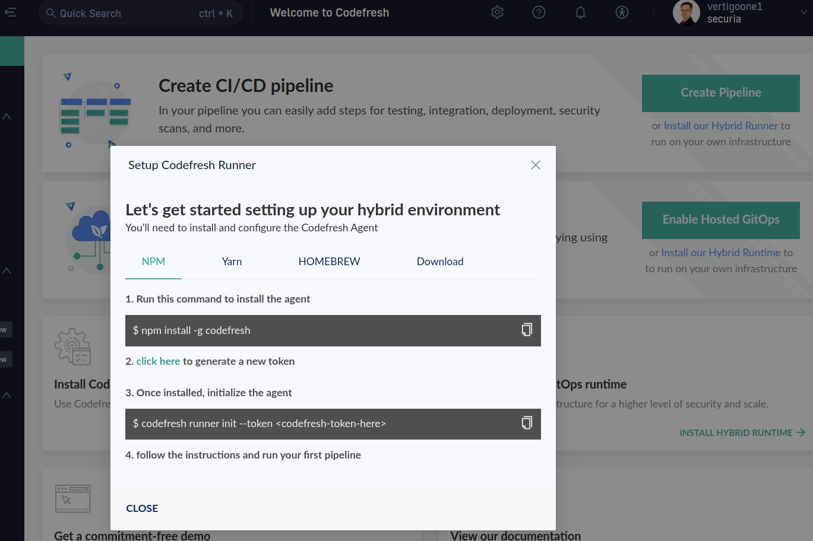
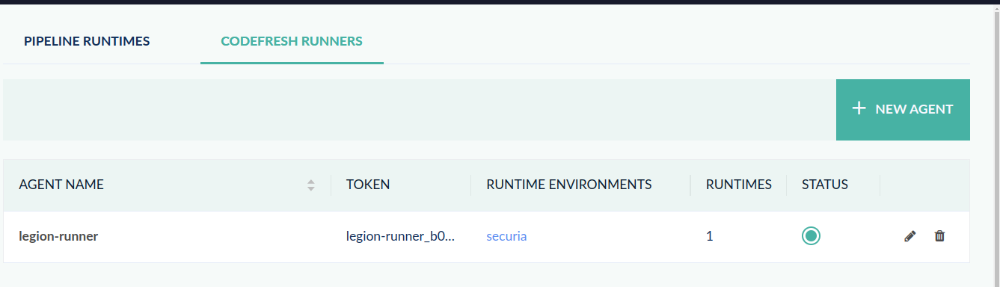

# Codefresh init

## Basics

Sign-up, google used

Link repo, private requires a pat generation, public is just approval. It does want to have a lot of access!

## Local

### If using self-hosted runners

The documentation here is out of date, after a careful reading, the deployment is now via helm.

The more up to date information is here.

<https://codefresh.io/docs/docs/installation/runner/install-codefresh-runner/>

the below was the wrong

<s>

You need this cli tool to manage deployments? I think it might be possible to swap, but i believe it is to generate secure tokens to authorise to create a context

the below is legacy

<https://github.com/codefresh-io/cli?tab=readme-ov-file>

as is this screen




```bash
wget https://github.com/codefresh-io/cli/releases/download/v0.87.6/codefresh-v0.87.6-linux-x64.tar.gz
tar xvfp codefresh-v0.87.6-linux-x64.tar.gz
sudo mv codefresh /usr/local/bin/codefresh
sudo chmod +x /usr/local/bin/codefresh
```

generate a token and run the command

The docuemntation here is out-dated and providing conflicting information on token

```bash
codefresh runner init --token <token>
```

on the repo, the accounts settings links does not work either

</s>

The documentation regarding "getting started" also makes you think you need to start with a runner, but all those links are incorrect

### Helm deployment of self-hosted runners

Hosted here

<https://artifacthub.io/packages/helm/codefresh-runner/cf-runtime>

```bash
helm show all oci://quay.io/codefresh/cf-runtime
```

configure the minimum values, done under

`infra/codefresh/helm/values`

```bash
helm upgrade --kube-context legion --install cf-runtime oci://quay.io/codefresh/cf-runtime -f values.yaml -f secrets://values_secrets.yaml --create-namespace --namespace codefresh
```

The runner will registry with codefresh



## Setup GitOps runtime

Codefresh essentially replaces the function of argocd, but it can "co-exist" for a time. The process is fairly complicated, but well described. Careful reading of the docs advised, especially the do's and don'ts

<https://codefresh.io/docs/docs/installation/gitops/argo-with-gitops-side-by-side/>

### Migrate CRD ownership to codefresh

```bash
curl https://raw.githubusercontent.com/codefresh-io/gitops-runtime-helm/main/scripts/adopt-crds.sh | bash -s <runtime-helm-release name> <runtime-namespace>
```

it is unclear what the runtime-helm-release and runtime-namespace is this early, so you have to plan ahead, in that when you install the cf runtime later, it uses the same values used above, but it is several pages down.

additionally, i'm going to use the ingress routine, and use external dns and certmanager to sign it, for my k3s homelab that would be traefik ingress controller


```bash
helm upgrade --install <helm-release-name> \
  --create-namespace \
  --namespace <namespace> \
  --set global.codefresh.userToken.token=<codefresh-api-key> \-
  --set global.runtime.name=<runtime-name> \
  --set global.runtime.ingress.enabled=true \
  --set "global.runtime.ingress.hosts[0]"=<ingress-host> \
  --set global.runtime.ingress.className=<ingress-class> \
  oci://quay.io/codefresh/gitops-runtime \
  --wait  
```

the following then overrides the cf objects to allow split tracking the deployment objects.

...
  --set argo-cd.fullnameOverride=codefresh-argo-cd \
  --set argo-rollouts.fullnameOverride=codefresh-argo-cd \
  --set argo-cd.configs.cm.application.resourceTrackingMethod=annotation+label \
...

after a thorough review, the following needs to be noted. You cannot test the same project before "migrating" it from argocd to cf, the object finalisers, CRD ownership and run numbers and thus image tags and such will conflict. It is possible to deploy to another namespace, one with argocd and one with cf, but you basically are stretching the stability of the app, because you need to be very careful with the values so you don't "share" settings.

My private code base for securia, this will be a bit of stretch and not time efficient, and as it is only a single project and my homelab is a bit stretched on resources to deploy a dev2, so i'm
deleting the argocd and rebuilding it from scratch.